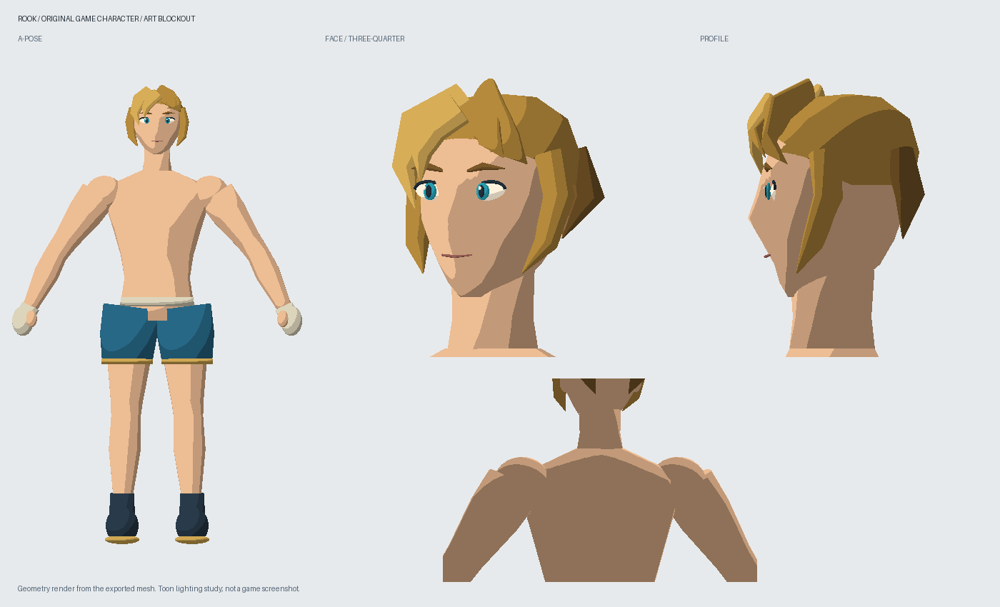

# Rook: 독립 게임용 캐릭터 초안

링크 레퍼런스를 확인하며 새로 작성한 절차적 메시다. 닌텐도의 모델·텍스처·애니메이션을 추출하거나 변환한 파일이 아니다. 이름, 금갈색 헤어, 푸른 눈, 짧은 훈련 바지와 핸드랩은 검토용 제안이며 최종 승인된 외형이 아니다.



이 이미지는 GLB에 기록한 것과 동일한 메시를 오프라인에서 렌더링했다. 생성형 이미지나 게임 스크린샷이 아니다. 명암을 단계화한 검토용 조명을 사용했으며, GLB의 기본 재질만 가져오면 이 카툰 명암이 자동 재현되지는 않는다.

## 파일

- `rook.glb`: 스킨과 뼈대, `rig_check` 변형 확인 클립을 포함한 모델.
- `profile.json`: 팔레트와 일부 얼굴 매개변수. 체형·메시 단면과 헤어 제어점은 제작 스크립트에 있다.
- `model-preview.png`: 정면 전신, 사선 얼굴, 측면, 뒤쪽 상체 검토 렌더.
- `rig-check-preview.png`: 내보낸 GLB를 다시 읽어 관절 변형을 계산한 검증 렌더.
- `build-report.json`: 생성 결과의 정점·삼각형·관절 수와 파일 크기.
- `../../../tools/character/build_rook.py`: 수정 가능한 원본 제작 코드. Blender 원본 파일은 아직 없다.

## 재생성 및 검증

저장소 루트에서 실행한다. Python에 NumPy와 Pillow가 필요하다. 게임 실행에는 이 의존성이 필요하지 않다.

```sh
python tools/character/build_rook.py
python tools/character/validate_rook.py
```

## 게임 이식 계약

좌표는 미터 단위, 위쪽은 +Y, 정면은 +Z다. 기존 FCM 절차적 선수는 +X 정면이므로 연결 시 바깥 그룹에서 Y축 회전을 적용하고, 기존 선수와 키·바닥 높이를 맞춰야 한다. `rook.glb`는 독립 자산이며 현재 `dist/`의 선수를 교체하지 않았다.

| 골격 이름 | 의미 |
| --- | --- |
| hips / spine / chest / neck / head | 골반부터 머리까지 |
| clavicle_L,R / upper_arm_L,R / forearm_L,R / hand_L,R | 쇄골·팔·손 |
| thigh_L,R / shin_L,R / foot_L,R | 허벅지·종아리·발 |

L/R은 캐릭터 기준 좌우다. 바인드 자세는 A 자세이며 노드의 로컬 회전은 단위 쿼터니언이다. 관절 위치와 계층이 길이와 회전 중심을 정한다. `rig_check`는 왼쪽 팔꿈치 변형을 확인하는 클립일 뿐 펀치나 가드 애니메이션이 아니다. 기존 전투의 IK 목표를 이 골격의 회전으로 변환하는 연결 작업이 필요하다.

## 현재 한계와 다음 작업

현재 단계는 외형과 이식 구조를 함께 검토하기 위한 **로우폴리 블록아웃**이다. 최종 미형 품질을 달성했다고 간주하지 않는다.

- 얼굴의 눈꺼풀·입·헤어가 단순하며, 측면 실루엣과 표정은 추가 조형이 필요하다.
- 몸통·팔다리·어깨는 개별 닫힌 메시라 접합부가 용접되지 않았다. 극단적인 자세에서는 이음매와 겹침이 보일 수 있다.
- 손가락 개별 관절, 얼굴 표정 리그, UV·텍스처, 머리카락 물리, 최종 카툰 셰이더는 없다.
- 뼈대는 포함하지만 기존 전투 애니메이션 연결과 게임 내 시각 검수는 아직 하지 않았다.
- 다음은 외형 검토 후 어깨/고관절 접합 개선, 가드·잽 연결, 같은 조명에서 레퍼런스와 나란히 비교하는 작업이다.

시각 기준은 [고정 레퍼런스](../../../docs/art/reference/link/README.md)에서 확인한다. 이미지를 교체하지 않고 모델 변경 이유를 Git 이력으로 남긴다.
