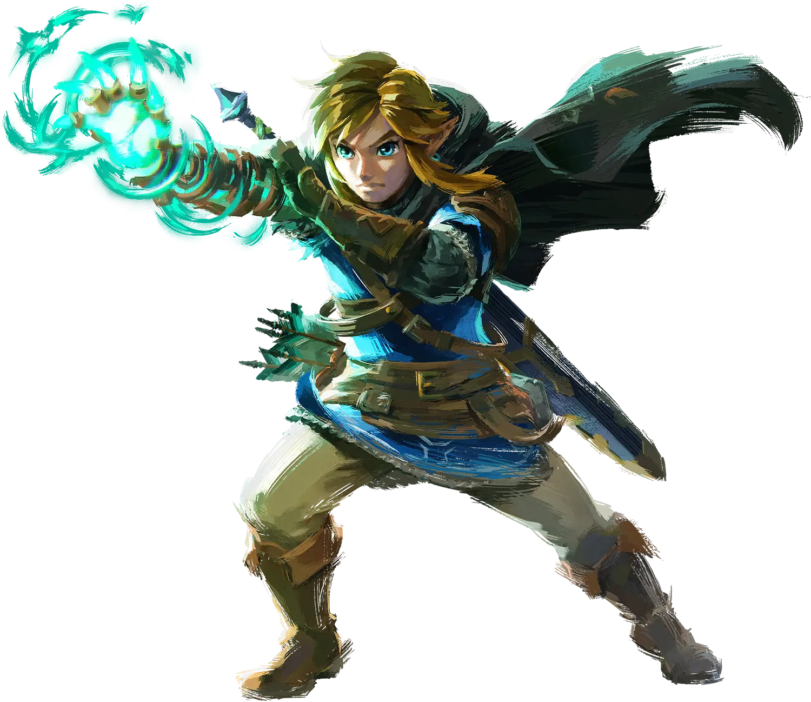
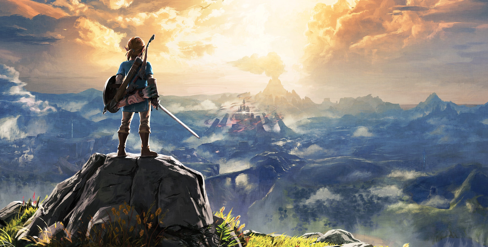
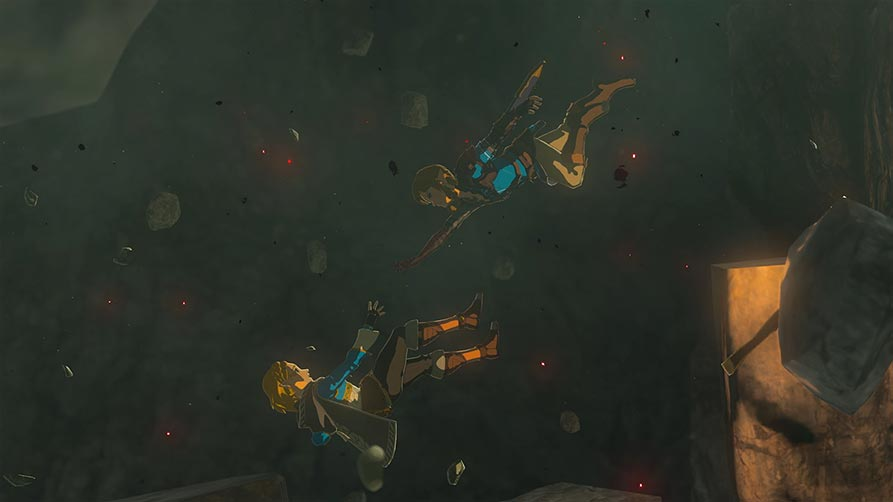
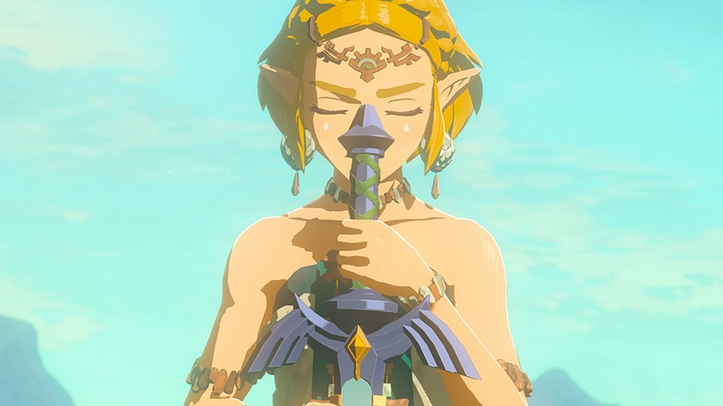

# 링크 캐릭터 레퍼런스

FCM 캐릭터 외형의 고정 시각 기준. 사용자가 선택한 대상은 **야생의 숨결과 왕국의 눈물의 링크**다. 추상적인 ‘미형’, 기억, 텍스트 프롬프트만으로 외형을 다시 해석하지 않는다. 아래 저장된 이미지를 실제로 열어 비교한다.

## 주 기준: 왕국의 눈물

[닌텐도 공식 캐릭터 페이지](https://www.nintendo.com/jp/zelda/totk/character/index.html)에서 받은 원본 파일이다. 눈매, 좁아지는 턱선, 얼굴을 감싸는 옆머리, 큼직하게 나뉜 머리카락 덩어리와 역동적인 실루엣을 참고한다. 자세와 원근이 있으므로 정면 비례 도면처럼 수치를 추출하지 않는다.

## 보조 기준: 야생의 숨결

[닌텐도 공식 사이트](https://www.nintendo.com/jp/zelda/botw/index.html)의 키 아트 원본이다. 묶은 머리의 뒷모습, 날렵한 전신 실루엣, 따뜻한 빛과 푸른 의상의 대비를 참고한다. 얼굴이 보이지 않으므로 얼굴의 근거로 쓰지 않는다.

## 게임 화면 보충

왕국의 눈물 공식 페이지의 게임 화면이다. 링크의 동작 실루엣 참고용이며, 어두운 조명과 원근 때문에 얼굴 비례 측정에는 적합하지 않다.

같은 게임의 **젤다** 화면이다. 피부·머리의 명암 단계만 비교한다. 링크의 얼굴이나 체형 기준으로 사용하지 않는다. 정확한 캡처 빌드는 확인되지 않았다.

## 적용 기준

| 항목 | 유지할 시각 방향 | 검토 방법 |
| --- | --- | --- |
| 얼굴 | 또렷한 눈매, 좁아지는 턱, 단순한 코와 입 | 같은 시점의 모델 렌더와 주 기준 이미지를 나란히 비교 |
| 헤어 | 낱가닥보다 큰 덩어리, 얼굴 옆 실루엣 | 정면·측면·뒷면에서 얼굴과 헤어가 구분되는지 확인 |
| 체형 | 날렵한 전신, 과장되지 않은 근육 | 전신과 가드 자세에서 확인; 의상 아래 해부학은 추정으로 표시 |
| 표현 | 형태가 읽히는 색면과 명암 | 중립 조명과 실제 전투 조명을 각각 확인 |

위 표는 이미지에 대한 프로젝트의 해석이며 닌텐도의 제작 명세가 아니다. 성인 격투가로서 어깨·등·전완을 보강하는 정도, 머리색, 귀 모양, 복장은 아직 최종 승인된 외형이 아니다. 먼저 시안으로 확인한다. 이전 임시 흑발 선수 모델을 이 레퍼런스에 맞는 완성형으로 간주하지 않는다.

## 이후 작업 규칙

- 모델링·헤어·재질 변경 전에 이 문서와 실제 이미지 파일을 연다. 이미지 입력을 받는 생성 작업에도 파일을 직접 첨부한다.
- 일러스트와 게임 화면은 구분한다. 홍보 일러스트의 붓 터치를 게임 셰이더의 특성으로 단정하지 않는다. 게임 화면도 정투영 도면은 아니다.
- 링크의 얼굴 근접 화면과 정면·측면 자료는 아직 추가 확보 대상이다. 이번 보충은 전신 동작과 명암 비교용이며, 정확한 얼굴 비례를 확정할 자료가 모두 준비됐다고 주장하지 않는다.
- 새 렌더는 사용한 레퍼런스 ID와 Git 커밋, 변경 이유를 기록한다. 외형 기준을 바꿀 때 기존 이미지를 덮어쓰지 않고 새 파일과 변경 기록을 남긴다.
- 이 문서의 로컬 이미지 링크가 깨지거나 파일이 없으면 작업 전에 복구한다. 웹 검색 결과의 다른 이미지로 조용히 대체하지 않는다.

## 출처와 파일 보존

다운로드 주소, 원본 크기, 수집일, SHA-256은 [sources.json](sources.json)에 기록했다. 저장 파일은 리사이즈·크롭·재인코딩하지 않았다. 링크가 사라져도 Git에 보관된 동일한 이미지로 비교할 수 있다.

이미지 저작권은 Nintendo에 있다. 프로젝트의 코드 라이선스가 적용되는 자체 제작 자산이 아니다. 사용자 목적은 개인 학습 및 비배포 게임 제작이다. 자료는 개발 참고용으로 `docs/`에 보관하며 `dist/`에 복사하거나 게임에서 불러오지 않는다.
